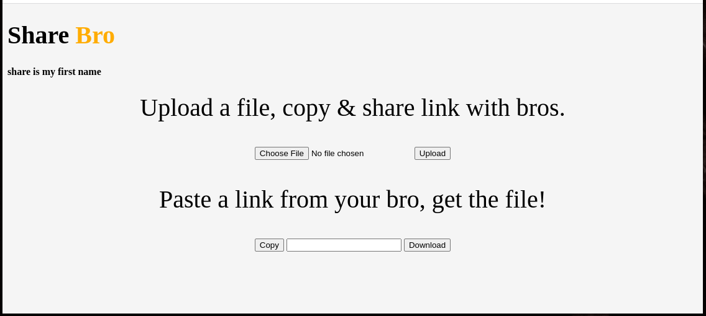

# ShareBro
 File Sharing applicaiton using AWS, Terraform.

> Disclaimer: I'm a python guy with cloud crush, don't judge my UI. This project is to practice/demonstrate devops skills.

### Demo (so far)


> **How this works**
> After selecting a file and clicking `upload`, a Flask API gets called and assigns a `UuID` to the file then gets and returns presigned url for `uuid.extension` which is used and finally uploads file to the desired bucket.

### S3 Bucker CORS Policy
```
[
    {
        "AllowedHeaders": [
            "*"
        ],
        "AllowedMethods": [
            "PUT",
        ],
        "AllowedOrigins": [
            "*"
        ],
        "ExposeHeaders": [
            "ETag"
        ],
        "MaxAgeSeconds": 3000
    }
]
```

### To Do
* basic html page - `done`
* backend script for file upload - `done` API
* backend scrit for file download -
* sctipt to copy url - `done`
* terraform, bash (automate) to host on **AWS s3** & **Cloudfront** -
* add route53 hosted zone - 
* CI/CD Pipeline -

(C) Ashraf-Minhaj

Note: sharebro name idea came out of my wet brain, don't know who owns the domain that keeps loading forever.