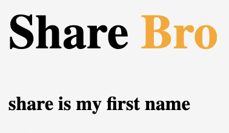
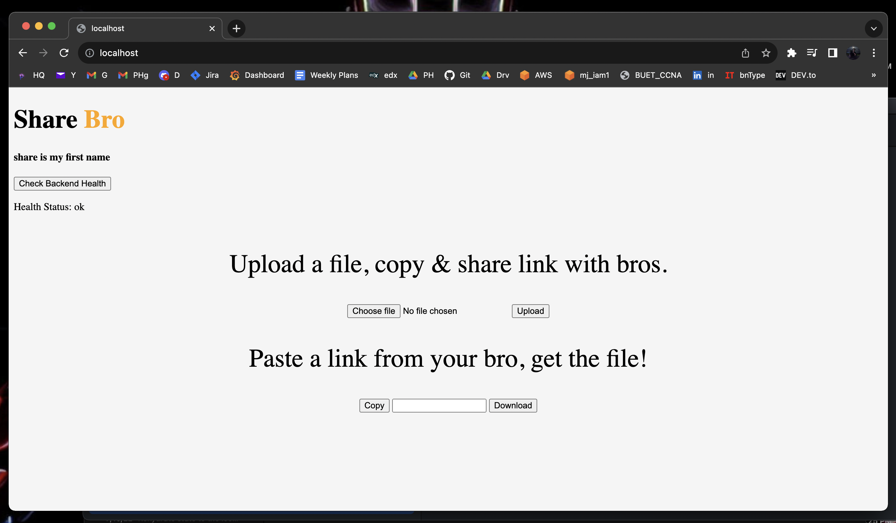

# ShareBro

File Sharing applicaiton using AWS, Terraform. Or just a demonstration of my SRE/DevOps skills.

-----------

&nbsp; &nbsp;

----------
## Demo so far
what's new: With Backend Health Check

> **How this works**
> After selecting a file and clicking `upload`, a Flask API gets called and assigns a `UuID` to the file then gets and returns presigned url for `uuid.extension` which is used and finally uploads file to the desired bucket.

## To Do
* basic html page - `done`
* backend script for file upload - `done`
* dockerize api - `done`
* dockerize frontend - `done`
* Use Docker Compose - `done`
* run both containers in one instance - `done`
* backend script for file download - 
* sctipt to copy url - `done`
* terraform, bash (automate) to host on **AWS s3** & **Cloudfront** -
* add route53 hosted zone - 
* CI/CD Pipeline -

(C) Ashraf-Minhaj

**Find me on** linkedin [/ashraf-minaj](https://www.linkedin.com/in/ashraf-minhaj)